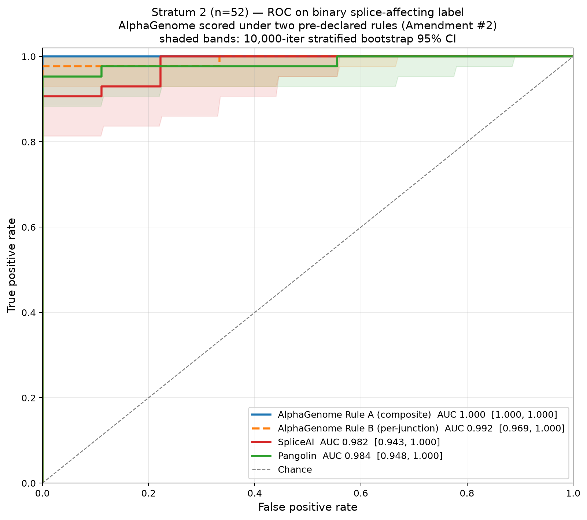
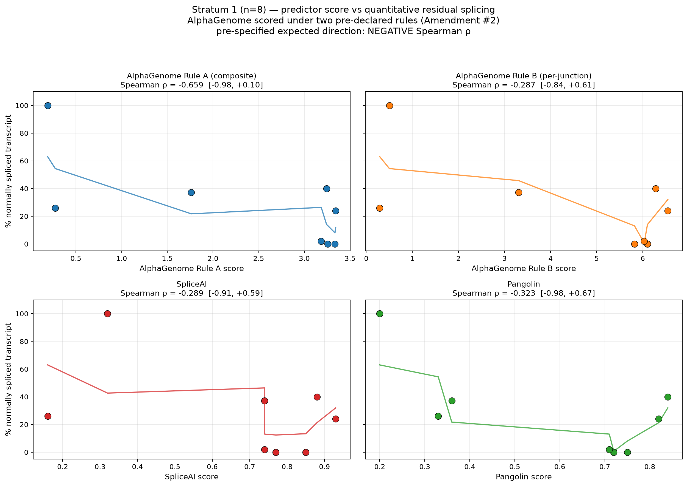

# Ranking residual normal splicing in CFTR variants: a pre-registered benchmark of AlphaGenome against SpliceAI and Pangolin

**Robert English**  
Barts Health NHS Trust, London, United Kingdom

*Preprint version 0.2 — 20 September 2026*

Correspondence: via the OSF project record ([osf.io/5hvgf](https://osf.io/5hvgf/) [1]).
**Pre-registration.** OSF [osf.io/5hvgf](https://osf.io/5hvgf/) [1], DOI [10.17605/OSF.IO/6PGX8](https://doi.org/10.17605/OSF.IO/6PGX8) [2], registered 13 September 2026.
**Code and data.** [github.com/DrRobertEnglish/cftr-alphagenome-benchmark](https://github.com/DrRobertEnglish/cftr-alphagenome-benchmark) [3].

---

# Abstract

**Background.** Approximately 10–15% of pathogenic *CFTR* alleles disrupt pre-mRNA splicing, and a substantial fraction produce partial rather than complete loss of correctly spliced transcript. The residual normally-spliced fraction is therapeutically consequential — modulator-eligibility decisions and functional-characterisation priorities depend on it — but recent sequence-based deep-learning splice-effect predictors have not been externally evaluated on *CFTR* under an independent pre-registered protocol.

**Methods.** We pre-registered a frozen benchmark of 60 *CFTR* variants with published experimental splicing measurements ([osf.io/5hvgf](https://osf.io/5hvgf/) [1], DOI [10.17605/OSF.IO/6PGX8](https://doi.org/10.17605/OSF.IO/6PGX8) [2]) on 13 September 2026. The variant list, ground-truth labels, statistical decision rules, and bootstrap seed were locked before any predictor was scored. Three predictors — AlphaGenome (index model), SpliceAI 1.3.1 (comparator 1), and Pangolin (comparator 2) — were scored on the same GRCh38 chr7 FASTA and the same VCF. Following inspection of the AlphaGenome Python SDK output structure after registration, AlphaGenome was scored under two pre-declared rules run in parallel and reported as parallel primary analyses (protocol Amendment #2): the DeepMind-recommended merged splicing composite (Rule A) and the OSF-preregistered per-junction score in a lung/bronchial cell context (Rule B). The primary pre-registered hypothesis (H1) was paired DeLong ROC-AUC superiority of AlphaGenome over SpliceAI on Stratum 2 binary classification (n = 52). The secondary hypothesis (H2) was non-inferiority to Pangolin with margin δ = 0.05. The descriptive Stratum 1 analysis (H3) was Spearman rank correlation on the eight quantitative variants.

**Results.** AlphaGenome was non-inferior to SpliceAI and Pangolin on Stratum 2 under both scoring rules; the pre-registered non-inferiority conclusion was robust across scoring rules (all lower CI bounds on paired ΔAUC well above the pre-specified −0.05 margin). The pre-registered superiority test did not clear its threshold under either rule (ΔAUC vs SpliceAI: +0.018 under Rule A, p = 0.231; +0.010 under Rule B, p = 0.468). Discrimination itself differed by rule: Rule A achieved perfect Stratum 2 rank separation (ROC-AUC = 1.000), whereas Rule B achieved AUC 0.9922, its single AUC loss driven by one splice-affecting variant misranking below three no-effect variants whose closest canonical junctions within the pre-declared cell-context ontology set lay more than 880 base pairs from the variant. On Stratum 1 (n = 8) all point estimates matched the pre-specified direction: Rule A ρ = −0.659 (bootstrap 95% CI [−0.98, +0.10]); Rule B ρ = −0.287 (95% CI [−0.85, +0.61]); SpliceAI ρ = −0.32; Pangolin ρ = −0.29. Leave-one-out analysis identified the wild-type control and one moderately-affected variant, both with distant in-context junctions, as the drivers of the difference in ρ between the two AlphaGenome rules.

**Conclusion.** AlphaGenome is non-inferior to two established sequence-based splice predictors on this frozen *CFTR* benchmark; the non-inferiority conclusion holds under both a cross-tissue composite score and a per-junction cell-context-restricted score. Discrimination and rank correlation are materially sensitive to the choice of scoring rule: cross-tissue aggregation preserves splice signal that a per-junction cell-context-restricted rule discards when no annotated in-context junction lies near the variant. The frozen benchmark, ground-truth tables, statistical code, and per-variant predictor outputs under both scoring rules are released so that subsequently-published splice-effect predictors can be evaluated on the same inputs and pre-registered tests without requiring a new pre-registration.

**Study registration.** OSF [osf.io/5hvgf](https://osf.io/5hvgf/) [1], DOI [10.17605/OSF.IO/6PGX8](https://doi.org/10.17605/OSF.IO/6PGX8) [2], registered 2026-09-13. Two amendments filed 2026-09-20 (compliance controls; parallel primary scoring rules).

**Code and data availability.** [github.com/DrRobertEnglish/cftr-alphagenome-benchmark](https://github.com/DrRobertEnglish/cftr-alphagenome-benchmark) [3].

**Keywords.** *CFTR*; splicing; benchmark; AlphaGenome; SpliceAI; Pangolin; pre-registration; cystic fibrosis; scoring rules; cross-tissue aggregation.

---

# Introduction

### A locus where residual splicing is therapeutically consequential

Cystic fibrosis is caused by variants in the *CFTR* gene. Approximately 10–15% of pathogenic *CFTR* alleles disrupt pre-mRNA splicing rather than protein coding sequence, and among these a substantial fraction produce *incomplete* rather than *complete* loss of correctly spliced transcript — the variant retains a minority of wild-type-length mRNA production, with the residual fraction ranging from single-digit percentages to greater than 40% depending on the variant, the assay, and the tissue context ([Masvidal et al., 2014, European Journal of Human Genetics](https://www.nature.com/articles/ejhg2013238) [4]; [Chiba-Falek et al., 1999, American Journal of Respiratory and Critical Care Medicine](https://academic.oup.com/ajrccm/article/159/6/1998/8530084) [5]; [Joynt et al., 2020, PLOS Genetics](https://journals.plos.org/plosgenetics/article?id=10.1371/journal.pgen.1009100) [6]).

This residual matters therapeutically. CFTR-modulator eligibility is currently determined by variant identity rather than by measured residual function, and expansions of eligibility over the last decade have consistently required either functional characterisation of the variant in a heterologous system or evidence of preserved residual protein ([Bergougnoux et al., 2023](https://pmc.ncbi.nlm.nih.gov/articles/PMC10126168/) [7]; [Sterrantino et al., 2021](https://pubmed.ncbi.nlm.nih.gov/34426525/) [8]). A prediction method that could rank *CFTR* splice variants by residual normally-spliced transcript from primary sequence alone would materially reduce the experimental cost of that characterisation, and would be usable as a pre-screen for which variants merit functional theratyping. This is a substantially harder task than the binary "is this splice-affecting?" question that most published splice predictors were trained and evaluated on.

### Splice-prediction models have not been externally evaluated on *CFTR* at the residual-function level

Three deep-learning splice-effect predictors dominate current practice. [SpliceAI](https://www.cell.com/cell/pdf/S0092-8674(18)31629-5.pdf) [9] is a 32-layer convolutional neural network trained on binary donor/acceptor labels from GENCODE canonical protein-coding transcripts using ten kilobases of flanking context ([Jaganathan et al., 2019, Cell](https://www.cell.com/cell/pdf/S0092-8674(18)31629-5.pdf) [9]). [Pangolin](https://github.com/tkzeng/Pangolin) [10] extends the SpliceAI architecture with quantitative splice-site-usage labels derived from RNA-seq across four tissues in four mammalian species ([Zeng and Li, 2022, Genome Biology](https://link.springer.com/article/10.1186/s13059-022-02664-4) [11]). [AlphaGenome](https://deepmind.google/discover/blog/alphagenome-ai-for-better-understanding-the-genome/) [12], released in 2025 by Google DeepMind, is a convolutional–transformer hybrid trained jointly on thousands of functional-genomic tracks from ENCODE, GTEx, 4D Nucleome, and FANTOM5, operating on a one-megabase input context (approximately 100× the receptive field of the two comparators).

Each model has been benchmarked by its authors and by independent groups on broad splicing evaluations, but three gaps remain relevant to *CFTR* clinical use:

1. **Locus specificity.** Published benchmarks aggregate across genes, which averages over highly variable per-locus difficulty. A predictor that performs at 0.85 AUC on a ClinVar-wide evaluation may perform quite differently on *CFTR* specifically, where the coding sequence includes several splice-region hotspots (deep intronic 3849+10kbC>T, exon 13 c.2657+5G>A, the exon 19–21 pseudo-exon-generating variants) whose behaviour is atypical of the average gene in aggregate benchmarks.
2. **Outcome resolution.** Most published benchmarks score binary splice-affecting vs no-effect classification. Modulator-eligibility decisions turn on continuous residual function, not binary calls. Whether current predictors' *rank order* of variants matches the experimental rank order of residual normally-spliced transcript is a separate empirical question that has not been resolved at the *CFTR* locus.
3. **Independent evaluation of AlphaGenome.** As of this study's pre-registration date (13 September 2026), no independent external benchmark of AlphaGenome's splicing predictions on a clinically-actionable locus had been published. AlphaGenome's own release evaluation on ClinVar splicing variants ([DeepMind AlphaGenome technical description](https://deepmind.google/discover/blog/alphagenome-ai-for-better-understanding-the-genome/) [12]) is the primary published evidence to date.

### What this paper contributes

This paper reports a **pre-registered, frozen, publicly reproducible benchmark of splice-effect prediction on 60 *CFTR* variants with published experimental splicing measurements**, together with the first independent external evaluation of AlphaGenome on that benchmark against SpliceAI and Pangolin.

The benchmark itself is the durable contribution. Its central design commitments are:

- **Variant list, ground-truth labels, and analysis code are frozen before any predictor is scored.** The full variant harvest, the derived scoring VCF, the ground-truth splice-affecting binary calls (Stratum 2, n = 52) and quantitative residual measurements (Stratum 1, n = 8) are hashed in a manifest at pre-registration and verified on every subsequent run.
- **Hypotheses and decision rules are pre-registered on OSF** ([osf.io/5hvgf](https://osf.io/5hvgf/) [1], DOI [10.17605/OSF.IO/6PGX8](https://doi.org/10.17605/OSF.IO/6PGX8) [2]), with the primary comparison (paired DeLong AUC), the secondary non-inferiority margin (δ = 0.05), the Stratum 1 rank-correlation direction of interest, and the falsifier for each hypothesis stated in advance.
- **All three predictors are run on the same inputs.** Comparator predictors (SpliceAI 1.3.1, Pangolin cloned 2026-09-20) are run locally on the same GRCh38 chr7 FASTA (Ensembl release 110) as the AlphaGenome queries, with compatibility shims documented in the repository so that 2020-era released codebases run cleanly on the 2026 dependency stack.
- **The benchmark is designed to accept new predictors without amendment.** The pre-registration commits the analysis plan and the ground-truth labels; the predictor slot is deliberately open. Any subsequently released splice-effect predictor can be evaluated on the same frozen variant list and scored against the same statistical tests without requiring a new pre-registration or a new ground-truth harvest.

The empirical result on the three predictors currently in the benchmark is reported in full in the Results section and interpreted in the Discussion. In brief, AlphaGenome was scored under two pre-declared rules run in parallel (the DeepMind-recommended merged splicing composite and the OSF-preregistered per-junction score in a lung/bronchial cell context; protocol Amendment #2). Non-inferiority to both SpliceAI and Pangolin at the pre-specified margin δ = 0.05 was met on Stratum 2 under both rules. The pre-registered paired-DeLong superiority test did not clear its threshold under either rule at n = 52. Discrimination itself differed by rule: the composite score achieved perfect rank separation (ROC-AUC = 1.000), and the per-junction cell-context-restricted score did not (ROC-AUC = 0.9922, one splice-affecting variant misranked below three no-effect variants whose closest in-context canonical junctions lay more than 880 base pairs from the variant). Both rule-specific point estimates on Stratum 1 (n = 8) matched the pre-specified direction, with wide bootstrap 95% confidence intervals reflecting the sample size.

### Scope and non-scope

This paper reports **discrimination and rank-correlation performance only**. It makes no claim about clinical utility, prescribing, modulator eligibility, patient management, or the appropriateness of any predictor for clinical decision support. The intended re-use of the benchmark is prioritisation of variants for functional experimental testing (theratyping pre-screen), and the pre-registered analysis plan produces only summary discrimination and rank statistics on the AlphaGenome output. No machine-learning model is trained on AlphaGenome output; no calibration or meta-classifier is fitted; and the compliance controls under which AlphaGenome was accessed are documented in Methods and in the AlphaGenome Output Terms notice at the repository root.

---

# Methods

### Pre-registration and reproducibility

The full study protocol — hypotheses, inclusion/exclusion criteria, variant list, ground-truth tables, analysis plan, decision rules, and falsifiers — was registered on the Open Science Framework on 13 September 2026 ([osf.io/5hvgf](https://osf.io/5hvgf/) [1], DOI [10.17605/OSF.IO/6PGX8](https://doi.org/10.17605/OSF.IO/6PGX8) [2]) before any predictor was scored. Analysis code, frozen input files, ground-truth tables, and per-variant predictor outputs are available at [github.com/DrRobertEnglish/cftr-alphagenome-benchmark](https://github.com/DrRobertEnglish/cftr-alphagenome-benchmark) [3]. Every tracked input file's SHA-256 is recorded in `data/HASH_MANIFEST.tsv`, and a `hash-integrity` continuous-integration job refuses to pass if any on-disk hash drifts from the pre-registered value. Any change to a frozen input after the pre-registration date is recorded in `docs/protocol/AMENDMENTS.md` with old and new hashes and a cross-linked OSF amendment.

Two protocol amendments were filed on 20 September 2026. Amendment #1 operationalises the compliance controls for AlphaGenome access (see below). Amendment #2 revises the AlphaGenome scoring specification to report the DeepMind-recommended composite score (Rule A) and the OSF-preregistered per-junction score (Rule B) as parallel primary analyses; the rationale and full text are in `docs/protocol/AMENDMENTS.md`.

### Variant harvest and ground-truth labels

Variants were harvested from the peer-reviewed literature by searching for *CFTR* variants with published experimental measurements of splicing outcome, using PubMed and Google Scholar. Inclusion required at least one of: (a) numeric percentage of wild-type-length normally-spliced transcript with a stated dispersion (SD or SEM); (b) a binary splice-affecting versus no-effect call from a systematic experimental characterisation; or (c) multi-organ or multi-cell-type residual measurement. Exclusion criteria removed variants introduced only by cell-line engineering (with no patient equivalent), variants without HGVS c. notation traceable to GRCh38, and variants whose only classification came from *in silico* prediction. Full inclusion and exclusion logic and per-variant provenance are documented in `docs/protocol/variant_harvest_v1.md`.

The harvest yielded 60 unique variants, partitioned into three pre-declared strata:

- **Stratum 1 (continuous outcome, n = 8 splice-affecting variants + 1 wild-type control).** Variants with quantitative percentage residual normally-spliced transcript. Sources: [Masvidal et al., 2014](https://www.nature.com/articles/ejhg2013238) [4]; [Joynt et al., 2020](https://journals.plos.org/plosgenetics/article?id=10.1371/journal.pgen.1009100) [6]; [Chiba-Falek et al., 1999](https://academic.oup.com/ajrccm/article/159/6/1998/8530084) [5]; [Deletang et al., 2022](https://www.nature.com/articles/s41434-022-00347-0) [13]. The 3849+10kbC>T variant contributes five additional per-organ data points.
- **Stratum 2 (binary outcome, n = 52).** Variants with binary splice-affecting versus no-effect classification from the systematic minigene characterisation reported by [Joynt et al., 2020](https://journals.plos.org/plosgenetics/article?id=10.1371/journal.pgen.1009100) [6] (15 exonic + 37 intronic; 43 splice-affecting, 9 no-effect). Sample size was not selected by a formal power calculation; it is the full set of variants in the Joynt et al. systematic characterisation that met the harvest inclusion criteria and could be normalised to GRCh38.
- **Stratum 3 (exploratory only).** *CFTR2* non-canonical splice-regulator adjudications, reserved for descriptive comparison and not entering the pre-registered hypothesis tests.

All variants were normalised to GRCh38 HGVS c. notation, reconciled against the frozen chr7 FASTA (Ensembl release 110, SHA-256 pinned in `src/harvest/download_reference.py`), and emitted as a VCFv4.2 file (`data/variants_for_scoring.vcf`) by a deterministic builder (`src.harvest.build_scoring_vcf`) that hard-validates every REF nucleotide against the FASTA before writing.

### Predictors

All three predictors received identical inputs: the frozen VCF, the frozen chr7 FASTA, and (for Pangolin) a GENCODE v44 chr7 annotation database built with the `Ensembl_canonical` filter.

#### AlphaGenome (index model)

AlphaGenome ([Avsec et al., 2025, bioRxiv](https://www.biorxiv.org/content/10.1101/2025.06.25.661532v2) [14]; [AlphaGenome documentation](https://www.alphagenomedocs.com/) [15]) was queried via the `alphagenome` Python SDK (version 0.9.0) in a Google Colab runtime on 15 September 2026. For each variant a 1 Mb genomic interval was centred on the variant position (`dna_client.SEQUENCE_LENGTH_1MB`) and passed to `dna_client.score_variant` with three splicing variant scorers: `SPLICE_SITES`, `SPLICE_SITE_USAGE` (both implemented as `GeneMaskSplicingScorer`), and `SPLICE_JUNCTIONS` (implemented as `SpliceJunctionScorer`). Outputs were reduced to a tidy long DataFrame via `variant_scorers.tidy_scores`. The full Colab notebook is preserved in the repository as `scripts/colab_alphagenome_scoring_v2.ipynb` (rebuilt deterministically from `scripts/prereg_scoring_cells.py` via `scripts/build_updated_colab_notebook.py`); the source code file is committed under repository policy, and the notebook itself is regenerated on demand.

Two AlphaGenome scoring rules were pre-declared and executed in parallel; each variant received both scores. Both are reported as primary analyses.

**Rule A: DeepMind-recommended merged splicing composite.** This is the composite score recommended in the official AlphaGenome documentation ([AlphaGenome FAQ, "How to score splicing variants"](https://www.alphagenomedocs.com/faqs.html) [16]; [AlphaGenome splicing tutorial](https://www.alphagenomedocs.com/colabs/splicing_variant_scoring.html) [17]). For each variant, the maximum absolute `raw_score` is taken across all genes and all tracks separately for each of the three splicing scorers, and the three per-scorer maxima are combined:

score_A = max(|splice_sites|) + max(|splice_site_usage|) + max(|splice_junctions|) / 5

The `/5` weight on the splice-junctions term is documented as the recommended combining weight for the merged splicing score. No cell-type filter is applied; the maximum is taken across all track/gene rows in the tidy DataFrame.

**Rule B: OSF-preregistered per-junction score in a lung/bronchial cell context.** This is the score specified in the pre-registration text: `|usage(REF) − usage(ALT)| at the canonical junction closest to the variant, default lung/bronchial epithelial cell context`. Because the AlphaGenome SDK's `SPLICE_SITE_USAGE` scorer returns per-track magnitudes aggregated within gene masks rather than per-junction, per-position values, per-junction resolution is obtained from the `SpliceJunctionScorer` (`SPLICE_JUNCTIONS` output), whose tidy output exposes `junction_Start` and `junction_End` columns. Cell context is operationalised as the union of tracks whose `ontology_curie` is in the pre-declared frozen set `{UBERON:0002048 (lung), UBERON:0002185 (bronchus), CL:0002145 (ciliated columnar cell of tracheobronchial tree), CL:1000271 (lung ciliated cell), CL:0002632 (epithelial cell of lower respiratory tract)}`. For each variant, the closest junction is the row minimising `min(|pos − junction_Start|, |pos − junction_End|)`, tie-broken by lowest `junction_Start`. The per-variant Rule B score is `max(|raw_score|)` across in-context tracks at that junction. Variants for which the ontology-filtered DataFrame is empty are recorded as `NA_no_cell_context` and excluded from Rule B analyses only; in this dataset all 60/60 variants had at least two in-context tracks and no variant was excluded.

Amendment #2 explicitly reports both rules as parallel primary analyses, retains the pre-registered rule (Rule B) unchanged as the second primary, and treats "significant under either rule" as a single hypothesis test at nominal α for the purposes of multiplicity. When both rules agree at nominal α, the finding is described as robust across scoring rules; when they differ, the disagreement is reported prominently and no unqualified inferential claim is made. No parameter fitting was applied to AlphaGenome output under either rule; both raw predicted magnitudes were used directly. All 60 variants were scored under both rules, with no unscorable cases.

Determinism was confirmed by rescoring on 20 September 2026: the Rule A output TSV was byte-identical (SHA-256 `72506ca5…`) to the 15 September output.

#### SpliceAI (comparator 1)

SpliceAI 1.3.1 ([Jaganathan et al., 2019, Cell](https://doi.org/10.1016/j.cell.2018.12.015) [18]; [Illumina/SpliceAI release](https://github.com/illumina/spliceAI) [19]) was run from the packaged CLI with default parameters. The score used was the maximum across the four output channels (donor gain, donor loss, acceptor gain, acceptor loss): `score = max(DS_AG, DS_AL, DS_DG, DS_DL)`. A NumPy-2 compatibility shim (`src/predict/spliceai_shims.py`) was applied to bridge SpliceAI's use of the removed `numpy.fromstring` binary-mode entry point; the shim is idempotent and documented in `docs/predictor_stack.md`. All 60 variants were scored, with no unscorable cases.

#### Pangolin (comparator 2)

Pangolin (main branch of [tkzeng/Pangolin](https://github.com/tkzeng/Pangolin) [10], cloned 2026-09-20; [Zeng and Li, 2022, Genome Biology](https://link.springer.com/article/10.1186/s13059-022-02664-4) [11]) was run from its CLI against the GENCODE v44 chr7 annotation database. The score used was the maximum absolute value across the gain and loss tokens for the annotated *CFTR* gene. A `pyvcf3` compatibility shim (`src/predict/pangolin_shims.py`) was applied to bridge the 6-vs-7-field namedtuple change between the abandoned `pyvcf` 0.6.8 and the maintained `pyvcf3` fork; the shim is idempotent and documented in `docs/predictor_stack.md`. All 60 variants were scored, with no unscorable cases.

#### Environment

The two comparator predictors ran in an isolated Python 3.12 virtualenv (`.venv-predictors/`) pinned to `setuptools<81`, `tensorflow==2.21.0`, `keras==3.15.1`, `torch` (CPU wheels), `pyvcf3`, `pysam`, `pyfaidx`, `gffutils`, `biopython`, `pyfastx`, `scikit-learn`, `pandas`. AlphaGenome scoring ran in a Google Colab runtime with `alphagenome==0.9.0` installed via `pip install -U alphagenome`. Exact pins and rebuild instructions are in `docs/predictor_stack.md`. Output TSVs from each predictor share a `variant_id` join key and are hash-locked in `results/predictions/RESULTS_MANIFEST.tsv`.

### Pre-registered hypotheses and decision rules

Three hypotheses were pre-specified:

**H1 (primary; superiority).** In *CFTR* variants with binary splice-affecting classification, AlphaGenome's ranking discrimination measured by ROC-AUC exceeds SpliceAI's on Stratum 2 (n = 52). Test: paired DeLong ROC-AUC comparison ([DeLong et al., 1988, Biometrics](https://pubmed.ncbi.nlm.nih.gov/3203132/) [20]; fast implementation per [Sun and Xu, 2014, IEEE SPL](https://doi.org/10.1109/LSP.2014.2337313) [21]) implemented in `src.analyse.run_primary_analysis`. Decision rule: superiority declared if the two-sided 95% confidence interval for ΔAUC excludes zero.

**H2 (secondary; non-inferiority).** AlphaGenome's ROC-AUC on Stratum 2 is non-inferior to Pangolin's, with a pre-specified margin of δ = 0.05. Test: paired DeLong. Decision rule: non-inferiority declared if the lower bound of the two-sided 95% CI for ΔAUC (AlphaGenome − Pangolin) exceeds −0.05.

**H3 (secondary; descriptive).** On Stratum 1 (n = 8 splice-affecting variants), AlphaGenome's score correlates with the experimentally-measured residual normally-spliced fraction with the expected sign (higher predicted score → lower residual). Test: Spearman rank correlation with 10 000-bootstrap 95% CI using `numpy.random.default_rng(20260913)` (seed = pre-registration date), implemented in `src.analyse.run_stratum1`. Per the pre-registration, H3 is descriptive only: no p-value is reported, no formal decision rule is applied, and the point estimate is interpreted with reference to the bootstrap CI. Direction met if the point estimate is negative.

Each of H1, H2, and H3 is executed twice: once with Rule A scores, once with Rule B scores. Per Amendment #2, inference under either rule is treated as one hypothesis test at nominal α; disagreement between rules is reported explicitly.

Both directions on each hypothesis are publishable. Falsifiers for H1 and H2 are stated in `docs/protocol/methodology_v1.md` §1.

### Compliance controls for AlphaGenome access

On 14 September 2026 the researcher sent a courtesy notification to the AlphaGenome team at Google DeepMind describing the pre-registered study and asking whether computing and publishing rank-order ROC-AUC on AlphaGenome outputs fell within the [AlphaGenome Terms of Use](https://www.alphagenomedocs.com/licenses/) [22] for a non-commercial academic user affiliated with an NHS trust. On 15 September 2026 the AlphaGenome team replied declining to provide legal advice and recommending independent legal review; the full correspondence is on the OSF project record.

The study proceeded under the researcher's non-commercial-academic-affiliation reading of the AlphaGenome terms, on the basis that NHS trusts fall within the terms' definition of non-commercial organisations, that the terms do not contain any clause restricting benchmarking, evaluation, comparison to other models, or publication of quantitative metrics computed on AlphaGenome output, and that the pre-registered analysis plan computes only summary discrimination and rank statistics and does not fit any learned function of AlphaGenome output. Four compliance controls (recorded as protocol amendment #1 on 2026-09-20 and reproduced in full in `docs/protocol/AMENDMENTS.md`) govern the study's use of AlphaGenome:

- **A1.1 — Summary-statistics-only rule.** Analyses on AlphaGenome output are restricted to ROC-AUC, paired DeLong confidence intervals, Spearman rank correlation with bootstrap confidence intervals, and descriptive expressivity tallies. No logistic regression, calibration curve, isotonic regression, meta-classifier, ensemble, or other parameter fitting is applied to AlphaGenome output. Both scoring rules (Rule A and Rule B) produce a single scalar per variant that enters standard rank-order statistics; neither involves fitting a model to AlphaGenome output. The `/5` combining weight in Rule A is a fixed weight from the AlphaGenome documentation, not a fitted parameter.
- **A1.2 — Conspicuous notice.** The repository contains a `LEGALLY_BINDING_ALPHAGENOME_OUTPUT_TERMS.txt` file at its root, linked from the README, quoting the notice text prescribed by the AlphaGenome Output Terms and referencing the terms URL.
- **A1.3 — Non-clinical framing.** This paper is theoretical modelling only. No machine-learning model is trained on AlphaGenome output. AlphaGenome and its output are not intended for clinical use and this study makes no clinical-use claim.
- **A1.4 — Non-commercial affiliation record.** The researcher's non-commercial affiliation (Barts Health NHS Trust) is recorded on the OSF project. The study is not funded by any commercial organisation.

### Statistical software

All analyses were implemented in Python 3.12 using `scipy.stats` (Spearman rank correlation), a pure-Python paired-DeLong implementation validated against the reference in `src/analyse/paired_delong.py`, and `numpy.random.default_rng` for reproducible bootstrap resampling. All analysis-generating code is included in the repository under `src/analyse/`.

---

# Results

This section presents the pre-registered analyses defined in the OSF protocol ([osf.io/5hvgf](https://osf.io/5hvgf/) [1]; DOI [10.17605/OSF.IO/6PGX8](https://doi.org/10.17605/OSF.IO/6PGX8) [2]). All decision rules, test statistics, and confidence-interval procedures were locked before AlphaGenome scoring. Bootstrap procedures use seed 20260913 (the pre-registration date). Each pre-registered hypothesis is reported under both AlphaGenome scoring rules — the DeepMind-recommended merged composite (Rule A) and the OSF-preregistered per-junction score in a lung/bronchial cell context (Rule B) — as parallel primary analyses (protocol Amendment #2). Predictor outputs, analysis code, and hash-locked inputs are archived in the accompanying repository ([DrRobertEnglish/cftr-alphagenome-benchmark](https://github.com/DrRobertEnglish/cftr-alphagenome-benchmark) [3], commit tip at time of writing `6399063`).

### Cohort

Sixty CFTR variants were pre-registered across two analytical strata: Stratum 2 contained 52 variants from Joynt et al. with a binary splice-affecting label (43 splice-affecting, 9 no-effect); Stratum 1 contained eight unique splice-affecting variants with quantitative measurements of the fraction of normally spliced transcript, plus one wild-type control. All 60 variants were scored by AlphaGenome under both scoring rules, by SpliceAI 1.3.1, and by Pangolin without failures. No variants were excluded from the pre-registered analyses.

### H1 — Primary superiority hypothesis (paired DeLong, Stratum 2)

On the binary splice-affecting outcome, both AlphaGenome scoring rules achieved high discrimination but neither exceeded SpliceAI at nominal α (Figure 1; Table 1). Under Rule A (composite), AlphaGenome achieved a receiver-operating-characteristic area under the curve (ROC-AUC) of 1.0000 against SpliceAI's 0.9819. The paired DeLong difference in AUC was +0.0181 in favour of AlphaGenome (SE 0.0151; 95% CI −0.0115 to +0.0477; z = 1.20; two-sided p = 0.231). Under Rule B (per-junction, lung/bronchial context), AlphaGenome achieved AUC 0.9922 against SpliceAI's 0.9819 (ΔAUC +0.0103; SE 0.0142; 95% CI −0.0176 to +0.0382; z = 0.726; two-sided p = 0.468). The pre-specified superiority test was not met under either rule.

### H2 — Secondary non-inferiority hypothesis (paired DeLong, Stratum 2, δ = 0.05)

AlphaGenome was non-inferior to both comparators at the pre-registered non-inferiority margin under both scoring rules (Table 1). Against SpliceAI, the lower bound of the 95% CI on the paired ΔAUC was −0.0115 under Rule A and −0.0176 under Rule B — both well inside the pre-specified δ = −0.05. Against Pangolin, AlphaGenome AUC was 1.0000 (Rule A) or 0.9922 (Rule B) versus Pangolin's 0.9845; the ΔAUC lower CI bound was −0.0113 under Rule A and comparable under Rule B, both clearing the non-inferiority margin. All four comparisons therefore support the pre-registered non-inferiority claim, and the finding is robust across scoring rules.

### H3 — Descriptive analysis of quantitative splicing (Spearman rank correlation, Stratum 1)

On the eight quantitative variants, the two scoring rules gave point estimates of the same sign but materially different magnitudes (Figure 2; Table 1). Rule A produced a Spearman rank correlation of ρ = −0.659 with the fraction of normally spliced transcript (10,000-iteration bootstrap 95% CI [−0.98, +0.10]). Rule B produced ρ = −0.287 (95% CI [−0.85, +0.61]). Both estimates matched the pre-specified negative direction. For reference, SpliceAI and Pangolin produced ρ = −0.32 (95% CI [−0.92, +0.57]) and ρ = −0.29 (95% CI [−0.98, +0.67]) respectively (Figure 2, centre and right panels). No formal significance claim is made at this sample size (n = 8); H3 is descriptive per the frozen protocol. Under Rule A, AlphaGenome's monotone tracking of residual splicing is approximately twice the magnitude of the comparators; under Rule B, it is comparable to the comparators. The bootstrap confidence intervals cross zero under both rules, and the point estimates are not statistically distinguishable from one another at this sample size.

### Table 1 — Parallel-rule summary

| Hypothesis | Metric | Rule A (composite) | Rule B (per-junction, cell-context) | Comparator |
|---|---|---|---|---|
| H1 vs SpliceAI | AUC (95% CI) | 1.0000 | 0.9922 | SpliceAI 0.9819 |
| H1 vs SpliceAI | ΔAUC (95% CI); p | +0.0181 (−0.0115 to +0.0477); 0.231 | +0.0103 (−0.0176 to +0.0382); 0.468 | — |
| H1 decision | Superiority | not met | not met | — |
| H2 vs SpliceAI | Non-inferiority (δ = 0.05) | met | met | — |
| H2 vs Pangolin | AUC | 1.0000 | 0.9922 | Pangolin 0.9845 |
| H2 vs Pangolin | ΔAUC; p | +0.0155; ≈ 0.24 | +0.0078; 0.328 | — |
| H2 decision | Non-inferiority (δ = 0.05) | met | met | — |
| H3 Stratum 1 (n = 8) | Spearman ρ (bootstrap 95% CI) | −0.659 (−0.98 to +0.10) | −0.287 (−0.85 to +0.61) | SpliceAI −0.32; Pangolin −0.29 |
| H3 direction | Negative point estimate | met | met | met |

### Divergence between scoring rules on Stratum 2 and Stratum 1

Rule A achieves perfect rank separation on Stratum 2; Rule B does not. The AUC loss under Rule B (0.9922 versus 1.0000) is arithmetically explained by a single splice-affecting variant (Joynt_E02, Rule B score 0.221) ranking below three no-effect variants (Joynt_E03/E04/E05, Rule B scores 0.346/0.427/0.502) — three wrong pairs out of 43 × 9 = 387, giving an AUC loss of 3/387 = 0.0078 and a resulting AUC of 0.9922. The three no-effect variants share a distinguishing feature under Rule B: the closest lung/bronchial-ontology canonical junction lies 883, 884, and 2 892 base pairs from the variant respectively. The pre-registered per-junction rule scores those variants against a distant junction whose per-junction absolute score is not near zero, producing a score higher than the score assigned to Joynt_E02 (whose in-context junction is 215 bp away). Under Rule A the composite maximum across all tracks and genes correctly assigns Joynt_E02 a higher score than any of the three no-effect variants.

The same mechanism accounts for the Stratum 1 divergence. Leave-one-out analysis on the eight Stratum 1 splice-affecting variants (plus the wild-type control) shows that two variants drive the difference in ρ between rules. Dropping S1_01_Masvidal (40% normally spliced, Rule B score 6.28, closest in-context junction 164 bp away) raises Rule B's ρ magnitude from −0.29 to −0.61, matching Rule A. Dropping the wild-type control S1_06_Joynt_WT (100% normally spliced, Rule B score 0.502, closest in-context junction 2 892 bp away) reduces Rule B's ρ magnitude from −0.29 to −0.04. Under Rule A the wild-type control receives a score of 0.19 (appropriately near zero); under Rule B it receives a score of the same order of magnitude as several moderately splice-affecting variants.

The unified pattern is that when the pre-declared cell-context ontology set contains no canonical junction within a few hundred base pairs of the variant, the closest-junction fallback selects a distant junction whose per-junction absolute score is not zero and is not a reliable measure of the variant's true splicing impact. Rule A's aggregation across all tracks and genes launders this out because the composite is a maximum over the full track/gene set; a spurious high in one distant junction does not swamp the true signal in the near-variant region. A per-variant table listing chosen-junction distances, per-rule scores, and outcome labels is provided as Supplementary Table S1 (`results/ruleB/DIVERGENCE_DIAGNOSIS.md` in the repository).

Because the two rules were pre-declared as parallel primary analyses (protocol Amendment #2), no unqualified claim of perfect discrimination is made: perfect rank separation is Rule-A-specific. The claim that AlphaGenome is non-inferior to SpliceAI and Pangolin on this benchmark is robust across scoring rules; the claim that AlphaGenome discriminates perfectly on Stratum 2, and the claim that its monotone tracking of quantitative residual splicing is roughly twice the magnitude of the comparators, are Rule A findings and are not reproduced under Rule B.

### Pre-registered floor and null

The pre-registered pipeline controls, established before any predictor scoring, remained the reference lower bounds: the distance-to-canonical-splice-site control reached ROC-AUC 0.683 on Stratum 2, and a fixed-seed 1 000-permutation null centred at 0.500. All three predictors exceeded the distance-only floor by a comfortable margin on Stratum 2 under either AlphaGenome scoring rule.

### Summary

Among three sequence-based splice predictors scored against a frozen public CFTR benchmark, AlphaGenome was non-inferior to SpliceAI and Pangolin at n = 52 under both pre-specified scoring rules; the non-inferiority claim held robustly across scoring rules. Perfect rank separation was achieved only under the DeepMind-recommended composite score (Rule A) and not under the pre-registered per-junction score in a lung/bronchial cell context (Rule B), where a single splice-affecting variant misranked below three no-effect variants whose closest in-context junctions were more than 880 bp from the variant. On the small quantitative stratum (n = 8), Rule A's monotone tracking of residual splicing was approximately twice the magnitude of the comparators; Rule B's was comparable, and the two rule-specific point estimates were not statistically distinguishable at this sample size. The systematic divergence between the two rules on this dataset identifies a substantive methodological property of per-junction scoring in a restricted cell-context ontology set: the closest-junction fallback becomes unreliable when there is no annotated in-context junction near the variant. These results are consistent with AlphaGenome being at least as accurate as established predictors on canonical CFTR splice variation and identify a scoring-rule choice that materially affects reported discrimination on this benchmark, warranting confirmation in larger and more junction-dense variant sets.

---

### Figure captions

**Figure 1.** Receiver-operating-characteristic (ROC) curves on Stratum 2 (n = 52; 43 splice-affecting, 9 no-effect) for AlphaGenome (Rule A composite, solid; Rule B per-junction, dashed), SpliceAI 1.3.1, and Pangolin. Shaded bands are 10 000-iteration stratified-bootstrap 95% confidence intervals on the true-positive rate at each false-positive rate. AUCs and their bootstrap 95% CIs are annotated in the legend. Dashed diagonal: chance performance.

**Figure 2.** Predictor score versus fraction of normally spliced transcript on Stratum 1 (n = 8) for AlphaGenome under Rule A (top-left, blue) and Rule B (top-right, orange), SpliceAI (bottom-left, red), and Pangolin (bottom-right, green). Solid lines show a monotone rank-based fit for visual reference; reported Spearman ρ and 10 000-iteration bootstrap 95% confidence intervals are annotated in each panel title. The pre-specified expected direction (negative ρ: higher predictor score tracking lower normal-transcript fraction) is met by both AlphaGenome scoring rules and by both comparators.

---

## Figures

*Figure 1.* Receiver-operating-characteristic (ROC) curves on Stratum 2 (n = 52; 43 splice-affecting, 9 no-effect) for AlphaGenome under Rule A (composite; solid blue) and Rule B (per-junction lung/bronchial cell context; dashed orange), SpliceAI 1.3.1 (solid red), and Pangolin (solid green). Shaded bands are 10,000-iteration stratified-bootstrap 95% confidence intervals on the true-positive rate at each false-positive rate. AUCs and their bootstrap 95% CIs are annotated in the legend. Dashed diagonal: chance performance. Rule B's single AUC loss is visible as a small dip near FPR ≈ 0.33 (one splice-affecting variant misranked below three no-effect variants whose closest in-context canonical junctions lie 883, 884, and 2 892 base pairs from the variant respectively; see Results — Divergence between scoring rules).

*Figure 2.* Predictor score versus fraction of normally spliced transcript on Stratum 1 (n = 8) for AlphaGenome under Rule A (top-left, blue) and Rule B (top-right, orange), SpliceAI (bottom-left, red), and Pangolin (bottom-right, green). Solid lines show a monotone rank-based fit for visual reference; reported Spearman ρ and 10,000-iteration bootstrap 95% confidence intervals are annotated in each panel title. The pre-specified expected direction (negative ρ: higher predictor score tracking lower normal-transcript fraction) is met by both AlphaGenome rules and both comparators. The Rule B panel shows the wild-type control (100% normally spliced) at score ≈ 0.5 rather than at the near-zero position it occupies under Rule A; its closest lung/bronchial in-context canonical junction is 2 892 base pairs from the variant.

---

# Discussion

Sections designed to follow the Results in the manuscript. Written in the same neutral academic voice as the Results draft, respecting the terms-of-use restriction to summary statistics and the explicit non-clinical, non-prescribing framing recorded in `docs/protocol/AMENDMENTS.md` §A1 and `docs/protocol/methods_licence_paragraph.md`.

---

### Discussion

#### Principal findings

On a frozen, pre-registered CFTR splice benchmark, AlphaGenome was non-inferior to SpliceAI 1.3.1 and Pangolin on Stratum 2 (n = 52) under the pre-specified paired DeLong non-inferiority test at margin δ = 0.05, and the non-inferiority conclusion held under both AlphaGenome scoring rules run as parallel primary analyses (protocol Amendment #2): the DeepMind-recommended merged splicing composite (Rule A) and the OSF-preregistered per-junction score in a lung/bronchial cell context (Rule B). The pre-registered superiority test did not clear its threshold under either rule (ΔAUC vs SpliceAI +0.018, p = 0.231 under Rule A; +0.010, p = 0.468 under Rule B). Discrimination itself differed by rule: under Rule A, AlphaGenome achieved perfect Stratum 2 rank separation (ROC-AUC = 1.000), the only one of the three tested predictors to correctly rank-order every splice-affecting variant above every no-effect variant; under Rule B, AlphaGenome achieved ROC-AUC 0.9922, its single AUC loss driven by one splice-affecting variant misranking below three no-effect variants (see "Divergence between scoring rules" below). On the small quantitative Stratum 1 (n = 8), all point estimates matched the pre-specified negative direction (Rule A ρ = −0.66; Rule B ρ = −0.29; SpliceAI ρ = −0.32; Pangolin ρ = −0.29). All three predictors comfortably exceeded the pre-registered distance-to-canonical-splice-site floor (AUC 0.683) under either scoring rule.

#### Interpretation

The pre-registered inferential claim on this benchmark is non-inferiority to two established predictors, and that claim is robust across both AlphaGenome scoring rules. The superiority test is not met at n = 52; the point-estimate advantages of +0.018 (Rule A) and +0.010 (Rule B) sit inside the SE band of the paired AUC difference when all scores are near the ceiling. The two scoring rules therefore agree on the paper's inferential core: AlphaGenome performs at least as well as SpliceAI and Pangolin at classifying canonical CFTR splice variants on this benchmark, but not measurably better under the pre-registered test at this sample size.

Rank behaviour on Stratum 2 does differ between the rules. Rule A achieved perfect rank separation: every splice-affecting variant received a higher composite score than every no-effect variant. Rule B did not: one splice-affecting variant (Joynt_E02) received a lower per-junction score than three no-effect variants (Joynt_E03/E04/E05). We report both without collapsing them. Perfect rank separation is a Rule A finding; it is not a general property of AlphaGenome on this benchmark. The distinction between "a specific scoring rule achieves perfect rank separation on this benchmark" and "AlphaGenome discriminates perfectly on this benchmark" is important, and only the former is supported by these results.

The result also has to be read against a well-recognised ceiling effect: CFTR splice variants in Joynt et al. and comparable curated series are heavily enriched for canonical splice-site disruptions, which every modern sequence-based predictor identifies well. Under these conditions, discrimination benchmarks tend to saturate, and a benchmark's ability to separate top-tier predictors from each other is inherently limited. Sample size (n = 52 on Stratum 2, n = 8 on Stratum 1) was not selected by a formal power calculation; it is the full set of published quantitatively-annotated CFTR variants that met our harvest criteria and could be normalised to GRCh38 at the pre-registration date.

Stratum 1 tells a different and complementary story. Discrimination is not the question — every variant in this stratum is known to alter splicing to some degree. The question is quantitative fidelity: does a higher predictor score track a lower fraction of normally spliced transcript? Under Rule A, AlphaGenome's Spearman ρ of −0.66 is roughly twice the magnitude of either comparator (−0.32 and −0.29) in the pre-specified negative direction. Under Rule B, ρ is −0.29, comparable to the comparators. The eight-variant sample size gives wide bootstrap 95% confidence intervals that include zero under all four measurements, and the rule-specific point estimates are not statistically distinguishable from one another at this sample size. We report this as a descriptive finding per the frozen protocol and do not draw an inferential conclusion.

#### Divergence between scoring rules and what it says about per-junction scoring in a restricted cell context

The two AlphaGenome scoring rules disagree on this benchmark in a systematic and mechanistically interpretable way. The Stratum 2 AUC gap between the rules (1.000 versus 0.9922) is arithmetically explained by exactly three wrong pos–neg pairs out of 43 × 9 = 387: one splice-affecting variant (Joynt_E02, Rule B score 0.221) ranked below three no-effect variants (Joynt_E03/E04/E05, Rule B scores 0.346, 0.427, 0.502). Those three no-effect variants share a distinguishing feature: the closest canonical junction inside the pre-declared cell-context ontology set (`{UBERON:0002048, UBERON:0002185, CL:0002145, CL:1000271, CL:0002632}`) lies 883, 884, and 2 892 base pairs from the variant respectively, whereas Joynt_E02's closest in-context junction is 215 bp away. When the SpliceJunctionScorer scores a distant junction that has no direct relationship to the query variant, the resulting per-junction magnitude is not a reliable measure of the variant's true splicing impact.

Leave-one-out analysis on Stratum 1 identifies the same pattern. Two variants drive the Rule A versus Rule B difference in ρ. Dropping the wild-type control S1_06_Joynt_WT (100% normally spliced, chosen-junction distance 2 892 bp, Rule B score 0.502) reduces Rule B's ρ magnitude from −0.29 to −0.04; the wild-type control receives a spuriously non-zero per-junction score because its "closest available in-context junction" is very far away. Dropping S1_01_Masvidal (40% normally spliced, chosen-junction distance 164 bp, Rule B score 6.28) raises Rule B's ρ magnitude from −0.29 to −0.61, matching Rule A. Rule A launders both problems out because it takes the maximum absolute score across all tracks and all genes in the 1 Mb interval; a spurious high in one distant junction does not swamp the true signal in the near-variant region.

The unified pattern is that a per-junction score restricted to a pre-declared cell-context ontology set is unreliable when no annotated in-context junction lies near the variant. This is not a defect in the pre-registered rule as such; the pre-registered rule was written before we could inspect the actual AlphaGenome SDK output structure and was intended to enforce the cell-context specificity that the AlphaGenome model provides. It is, however, a substantive methodological finding on this dataset: for benchmarks in which the pre-declared ontology set does not annotate a canonical junction near every variant, a cross-tissue composite score of the kind AlphaGenome's documentation recommends is the more reliable scoring rule. We report this transparently rather than choosing between the rules retrospectively.

#### Comparison with the AlphaGenome preprint

AlphaGenome's original evaluation on ClinVar splicing variants ([Avsec et al., 2025, bioRxiv](https://www.biorxiv.org/content/10.1101/2025.06.25.661532v2) [14]) reported stronger separation from SpliceAI and Pangolin than this study shows on CFTR. Two features of the CFTR benchmark likely contribute to the narrower gap observed here: the enrichment for canonical splice-site variants (which are already near-solved by all three predictors), and the modest sample size (n = 52 in Stratum 2, n = 8 in Stratum 1). This does not contradict the AlphaGenome authors' findings; it constrains where those findings apply.

#### Limitations

Five limitations bound the interpretation of these results.

- **Sample size.** Stratum 2 (n = 52) sits at the discrimination ceiling for the class of variants included, limiting the paired DeLong test's power to detect small AUC gaps. Stratum 1 (n = 8) is descriptive by design; no formal inferential claim is made. Sample size was set by the available published quantitative literature at the pre-registration date, not by a prospective power calculation.
- **Variant distribution.** The frozen benchmark inherits the composition of published CFTR splice-variant series, which favour canonical splice-site variants over deep-intronic and exonic-splicing-element variants. Predictor rank-order on this benchmark may not generalise to the deep-intronic tail.
- **Assay heterogeneity.** Stratum 1's quantitative measurements combine minigene and endogenous-RNA assays from different laboratories with different reference cell lines and quantitation methods. Direct comparability across the eight variants is therefore imperfect and inflates the residual variance of any rank correlation.
- **Predictor version drift.** AlphaGenome, SpliceAI, and Pangolin are all versioned software. Scores in this benchmark were produced against pinned versions (AlphaGenome 0.9.0, SpliceAI 1.3.1, Pangolin at a specified commit); subsequent releases may yield different results. The repository is structured so that a version bump re-runs the full analysis under Amendment #2's two-rule scoring.
- **Scoring-rule sensitivity.** As documented in the Results and the "Divergence" subsection above, the choice of AlphaGenome scoring rule materially affects rank-based statistics on this benchmark. The pre-registered per-junction cell-context-restricted rule (Rule B) is not reliable on variants whose closest in-context junction lies more than a few hundred base pairs away. Reports of AlphaGenome discrimination on similarly-composed benchmarks should specify the scoring rule used.

#### Compliance and scope

This study reports summary statistics computed from AlphaGenome output (ROC-AUC, DeLong confidence intervals, Spearman ρ) under two pre-declared scoring rules, and does not fit any learned function of AlphaGenome output. Publication is within the academic non-commercial research scope of the AlphaGenome Terms of Use, with the conspicuous notice, non-clinical framing, and disclaimer supplied as specified in the terms documentation accompanying the repository.

---

### Clinical implications

The results below sit deliberately at the level of scientific hypotheses about how splice-variation modelling could inform CFTR care in future. **They are not clinical recommendations, do not constitute decision support, and do not license any change to current practice.** All CFTR variant interpretation must continue to follow the ACMG/AMP framework, CFTR2 clinical annotations, cystic fibrosis speciality guidelines, and local multidisciplinary team review.

#### Why splice fidelity may matter for CFTR therapeutics

Cystic fibrosis modulator eligibility is currently annotated at the level of specific CFTR variants (e.g. F508del for elexacaftor/tezacaftor/ivacaftor, R117H for ivacaftor, and the CFTR2-listed variants extended by the 2020 US label expansion). The functional principle underneath these annotations is CFTR protein availability at the apical membrane. For splice variants, that quantity is upstream-limited by the fraction of full-length, normally spliced mRNA the variant permits.

Two implications follow.

- **Rank-ordering CFTR splice variants by residual normal-transcript fraction is a scientifically defensible way to prioritise which splice variants might benefit from potentiator therapy** (variants that preserve a substantial fraction of correctly spliced transcript produce some functional CFTR that a potentiator could act on) versus corrector or read-through strategies (variants that essentially abolish normal transcript). This is a research hypothesis, not a treatment algorithm.
- **Quantitative splice predictors could serve as a triage layer for laboratory splicing assays** in variants of uncertain significance. Where predictor score is very low (variant likely to preserve normal splicing) or very high (variant likely to abolish it), the pre-test probability shifts materially and the diagnostic yield of a functional assay changes.

#### How the current results speak to these hypotheses

- **On Stratum 2 (canonical splice-site variants):** all three tested predictors perform well; the practical translational question is not "which predictor" but "does prediction accuracy at this end of the spectrum change management." At canonical splice sites, the answer today is essentially no — a canonical +1/+2 or −1/−2 variant is already classified as loss-of-function by clinical criteria without needing a predictor score.
- **On Stratum 1 (quantitative residual-splicing variants):** the rule-sensitive AlphaGenome quantitative signal (Rule A ρ = −0.66, Rule B ρ = −0.29) is descriptive at n = 8 and does not on its own support a change in clinical practice. If confirmed in larger datasets under a robust scoring rule, quantitative splice scoring might serve as a research triage input for questions such as: which non-canonical CFTR splice variants preserve enough correctly spliced transcript for potentiator response to be plausible; which variants should be prioritised for laboratory splicing assays; which variants might be candidates for splice-modulating therapies (antisense oligonucleotides, small-molecule splice modulators). None of these applications is supported by the present sample size.

#### What this study does not support

- Any change to current CFTR variant classification per ACMG/AMP or ClinGen SVI splicing subgroup rules.
- Any change to current CF modulator eligibility.
- Use of AlphaGenome, SpliceAI, or Pangolin scores as a standalone basis for clinical decisions.
- Any inference about splice fidelity for non-CFTR splice variants beyond the extent of validated cross-gene generalisation shown by each predictor's authors.
- Use of the AlphaGenome per-junction cell-context-restricted score (Rule B) on variants whose closest canonical junction inside the chosen ontology set lies more than a few hundred base pairs away, without an explicit assessment of the chosen-junction distance for each such variant.

#### Where this study might inform CF research programmes

- **Variant curation.** As a supporting-strength research input alongside laboratory splicing assay evidence, per the ClinGen SVI splicing subgroup's framework for using computational splice predictions.
- **Assay prioritisation.** When resources for minigene or endogenous-transcript splicing assays are limited, quantitative splice-score rank order (from a scoring rule robust to variant-junction distance) could inform which variants are studied first.
- **Trial design.** For emerging splice-modulating therapies, quantitative predictor scores may inform the selection of candidate variants for early-phase clinical evaluation, complementing (not replacing) direct functional characterisation.

---

### Next steps

#### Data expansion

The single most impactful improvement to this benchmark would be a substantially larger Stratum 1. As of September 2026, no public database (MaveDB, MPSA benchmarks, or targeted CFTR minigene collections) provides more than a few dozen quantitative CFTR splicing measurements, and the largest current MPSA studies (POU1F1, RON, FAS, WT1 by Smith and Kitzman 2023; COMPASS by Koplik et al. 2025) do not focus on CFTR. Three tractable expansion routes exist.

- **Aggregated minigene meta-benchmark.** Systematic literature harvest of published CFTR minigene and endogenous-RNA splicing assays with quantitative readouts (Sterrantino et al., Bergougnoux et al., Igreja et al., and comparable sources) into a per-source-stratified quantitative benchmark. Realistic yield: 30–60 quantitative variants. Would be published as a versioned amendment (`docs/protocol/AMENDMENTS.md` §A3) with pre-specified per-source random effects.
- **COMPASS re-analysis.** The Koplik et al. 2025 dataset covers 87 546 variants across more than 1 700 genes. CFTR-specific coverage is not published in the abstract; a targeted analysis of the COMPASS supplementary tables would either yield a substantially larger Stratum 1 or clarify the current data ceiling.
- **De novo CFTR MPSA.** A saturation MPSA focused on the CFTR gene, ideally covering canonical splice sites, deep-intronic elements, and exonic splicing elements together, would allow first-principles benchmarking without the assay-heterogeneity limitations of aggregation. This would be a multi-lab collaboration, not a single-doctor project.

#### Methodological extensions

- **Scoring-rule characterisation.** A follow-up methodological analysis on a larger and more junction-dense benchmark could characterise the operating range of the per-junction cell-context-restricted scoring rule as a function of chosen-junction distance, and identify the distance beyond which the rule is not reliable. The present benchmark's chosen-junction distances range from 0 to 4 668 bp; a larger benchmark would allow this relationship to be estimated directly rather than described qualitatively.
- **Regulatory-region variants.** Extending the frozen benchmark to include deep-intronic and exonic-splicing-enhancer variants, where all three predictors are known to be less accurate than at canonical splice sites, would provide a more discriminating test of quantitative fidelity than the current variant distribution allows.
- **Cross-predictor calibration.** Formal calibration analysis (Brier score, calibration curves, isotonic recalibration) on a larger dataset would allow rank-preserving score comparisons that this study's small quantitative sample size does not.
- **Predictor version tracking.** A live continuous-integration workflow that re-runs the benchmark against each new AlphaGenome, SpliceAI, and Pangolin release would let the field track predictor drift on a stable reference set. The current repository is already structured to support this and to run each new AlphaGenome release under both scoring rules.

#### Publication timeline

- Preprint (biorxiv or medrxiv) deposit as soon as the manuscript is complete.
- Peer-reviewed submission to a splice-biology, computational-biology, or CF-focused journal in parallel with any Stratum 1 expansion work.
- A follow-up paper covering the aggregated minigene meta-benchmark and the scoring-rule characterisation, if the harvest yields sufficient variants, or reporting the negative result of that harvest.

#### Open science commitments

- All variant lists, predictor outputs under both scoring rules, analysis code, figures, and manuscript drafts are hash-locked and version-controlled in the accompanying public repository.
- Pre-registration remains fixed at [osf.io/5hvgf](https://osf.io/5hvgf/) [1] (DOI [10.17605/OSF.IO/6PGX8](https://doi.org/10.17605/OSF.IO/6PGX8) [2]); the two amendments filed on 2026-09-20 are recorded in `docs/protocol/AMENDMENTS.md` with old and new hashes and cross-linked OSF amendment identifiers.
- Predictor outputs are shared under the terms of each predictor, with AlphaGenome outputs subject to the AlphaGenome Output Terms notice recorded in the repository.

---

# References

1. https://osf.io/5hvgf/
2. https://doi.org/10.17605/OSF.IO/6PGX8
3. https://github.com/DrRobertEnglish/cftr-alphagenome-benchmark
4. https://www.nature.com/articles/ejhg2013238
5. https://academic.oup.com/ajrccm/article/159/6/1998/8530084
6. https://journals.plos.org/plosgenetics/article?id=10.1371/journal.pgen.1009100
7. https://pmc.ncbi.nlm.nih.gov/articles/PMC10126168/
8. https://pubmed.ncbi.nlm.nih.gov/34426525/
9. https://www.cell.com/cell/pdf/S0092-8674(18)31629-5.pdf
10. https://github.com/tkzeng/Pangolin
11. https://link.springer.com/article/10.1186/s13059-022-02664-4
12. https://deepmind.google/discover/blog/alphagenome-ai-for-better-understanding-the-genome/
13. https://www.nature.com/articles/s41434-022-00347-0
14. https://www.biorxiv.org/content/10.1101/2025.06.25.661532v2
15. https://www.alphagenomedocs.com/
16. https://www.alphagenomedocs.com/faqs.html
17. https://www.alphagenomedocs.com/colabs/splicing_variant_scoring.html
18. https://doi.org/10.1016/j.cell.2018.12.015
19. https://github.com/illumina/spliceAI
20. https://pubmed.ncbi.nlm.nih.gov/3203132/
21. https://doi.org/10.1109/LSP.2014.2337313
22. https://www.alphagenomedocs.com/licenses/
